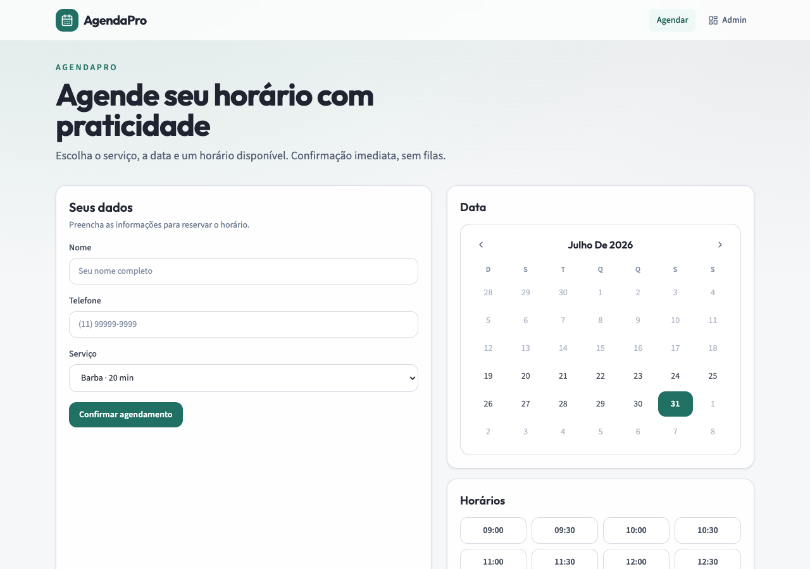
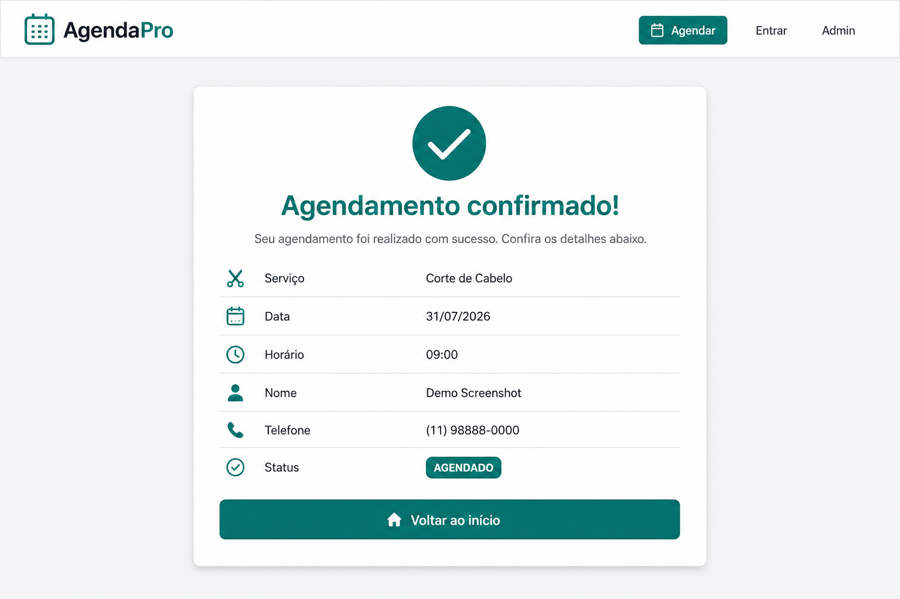
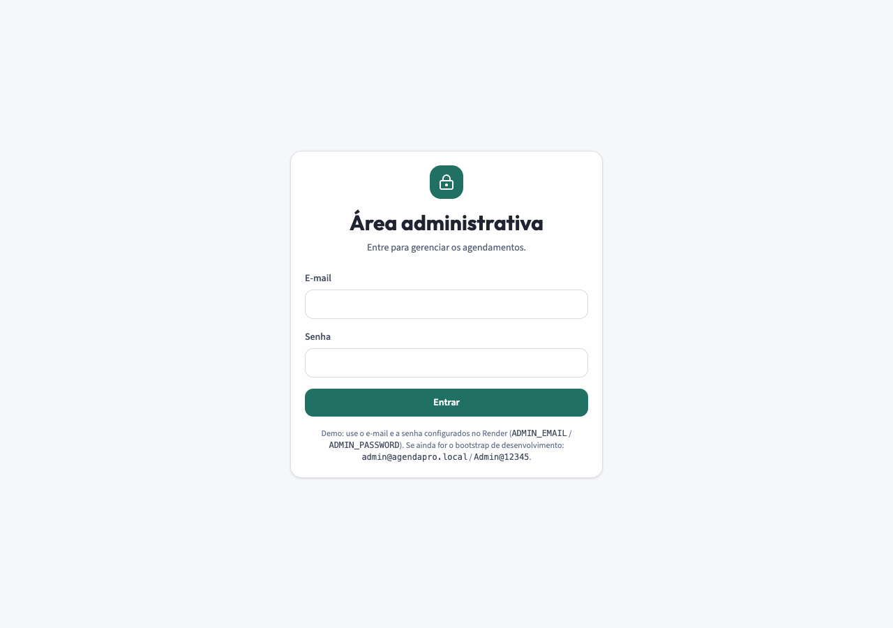
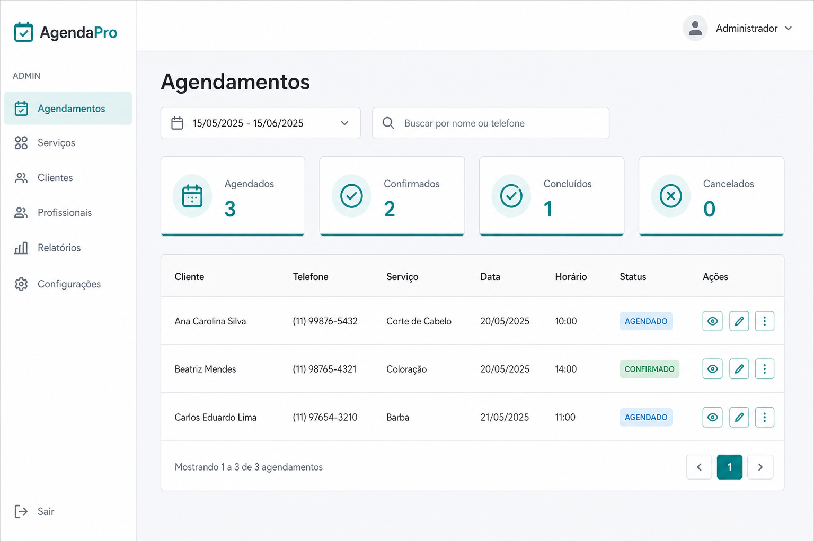
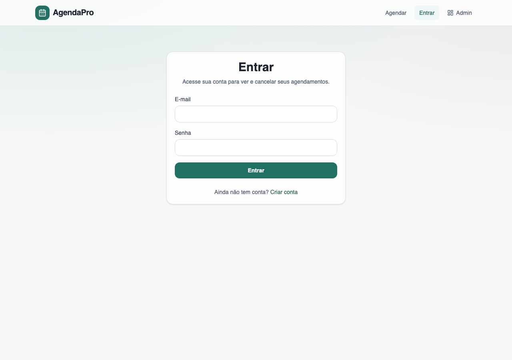
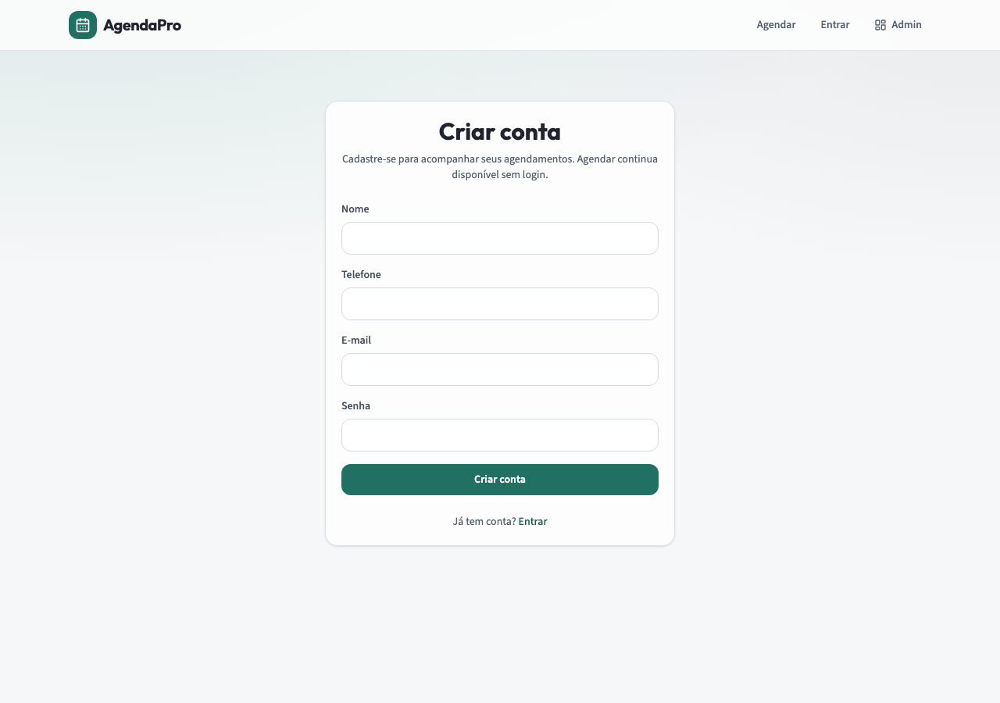
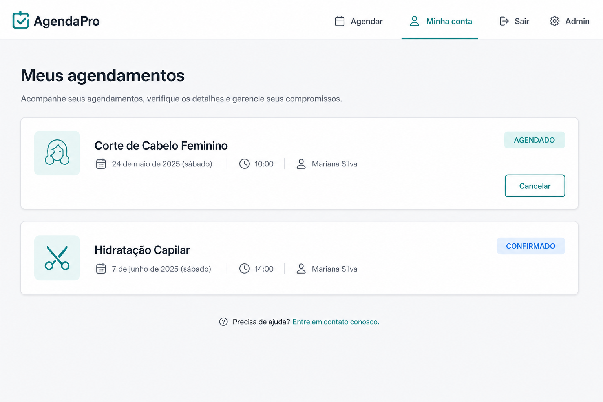

# AgendaPro — Service Scheduler

Sistema full-stack de agendamento de serviços, desenvolvido para o desafio técnico do DevClub.

Clientes agendam online com horários reais (sem conflito). Administradores gerenciam a agenda com autenticação JWT. Persistência em PostgreSQL, schema versionado com Flyway.

[](https://openjdk.org/)
[](https://spring.io/projects/spring-boot)
[](https://react.dev/)
[](https://supabase.com/)

---

## Demo em produção

| Recurso | URL |
|---------|-----|
| Frontend | https://service-scheduler-puce.vercel.app |
| Backend API | https://service-scheduler-l3g7.onrender.com/api/v1 |
| Health | https://service-scheduler-l3g7.onrender.com/actuator/health |
| Repositório | https://github.com/JaelsonS/service-scheduler |

> No Render (plano free), o backend pode “dormir” após inatividade. A primeira requisição pode levar ~30–60s.

### Credenciais de demonstração

| Papel | E-mail | Senha |
|-------|--------|--------|
| Admin | `admin@agendapro.local` | `Admin@12345` |
| Cliente | Cadastro livre em `/cadastro` | — |

---

## Descrição

### Cliente (público)

- Agendar serviço informando nome, telefone, serviço, data e horário
- Consultar apenas horários disponíveis (ocupados não aparecem)
- Visualizar confirmação em `/confirmacao/:id`
- Conta opcional (`/cadastro`, `/entrar`) para ver e cancelar os próprios agendamentos em `/minha-conta`

### Administrador

- Login em `/admin/login` (JWT com role `ADMIN`)
- Listar todos os agendamentos com dados do cliente
- Filtrar por data e buscar por nome/telefone
- Alterar status: `AGENDADO` → `CONFIRMADO` → `CONCLUIDO` / `CANCELADO`
- Cancelar ou excluir agendamentos

---

## Tecnologias

| Camada | Stack |
|--------|--------|
| **Frontend** | React 19, TypeScript, Vite 8, Tailwind CSS 4, React Router 7, React Hook Form, Zod, Axios |
| **Backend** | Java 25, Spring Boot 4.1, Spring Web, Spring Data JPA, Spring Security, Bean Validation, Flyway, Actuator, springdoc OpenAPI |
| **Banco** | PostgreSQL (Supabase em produção; local opcional) |
| **Auth** | JWT (access + refresh), BCrypt, roles `ADMIN` / `CLIENT` |
| **Deploy** | Frontend: Vercel · Backend: Render (Docker) · DB: Supabase |


## Decisões técnicas

Optei por um **backend em Spring Boot** para aprofundar estudos em Java (camadas, JPA, Security, Flyway, Bean Validation), mesmo podendo ter usado soluções mais simples como Supabase Edge Functions ou um BaaS completo.

Outras escolhas importantes:

- **PostgreSQL + Flyway** — schema versionado; Hibernate em modo `validate` (não cria tabelas sozinho)
- **Índice único parcial** — impede dois agendamentos ativos no mesmo horário mesmo sob concorrência
- **JWT stateless** — CSRF desnecessário (token no header, sem cookie de sessão)
- **Rate limiting em memória** — proteção básica por IP (adequado a instância única no Render)
- **CORS restrito** — localhost + `*.vercel.app` + origens extras via env
- **SEO em SPA** — meta tags estáticas no `index.html` + `SeoHead` dinâmico por rota; `robots.txt` e `sitemap.xml`

Detalhes: [`docs/architecture-decisions.md`](docs/architecture-decisions.md) e [`docs/project-decisions.md`](docs/project-decisions.md).

---

## Estrutura do projeto

```text
service-scheduler/
├── backend/                  # API Spring Boot
│   ├── src/main/java/...     # Controllers, services, security, DTOs
│   ├── src/main/resources/   # application*.properties + Flyway (V1–V4)
│   ├── src/test/java/...     # Testes
│   ├── Dockerfile            # Deploy Render
│   ├── render.yaml
│   └── .env.example
├── frontend/                 # SPA React
│   ├── src/pages/            # Cliente + Admin
│   ├── src/components/       # UI, booking, layout, SEO
│   ├── public/               # favicon, robots.txt, sitemap.xml
│   ├── vercel.json
│   └── .env.example
├── docs/                     # ADRs, setup externo, screenshots, estudo
└── README.md
```

---

## Como executar localmente

### Pré-requisitos

- Java 25
- Maven Wrapper (`./mvnw` incluso) ou Maven 3.9+
- Node.js 20+
- PostgreSQL (Supabase gratuito ou instância local)

### 1. Banco de dados

```bash
cp backend/.env.example backend/.env
```

Preencha no mínimo:

| Variável | Descrição |
|----------|-----------|
| `DB_URL` | JDBC PostgreSQL (`jdbc:postgresql://...`) |
| `DB_USERNAME` / `DB_PASSWORD` | Credenciais |
| `JWT_SECRET` | String aleatória com ≥ 32 caracteres |
| `CORS_ALLOWED_ORIGINS` | Ex.: `http://localhost:5173` |
| `ADMIN_EMAIL` / `ADMIN_PASSWORD` | Admin inicial |

As migrations Flyway (`V1`–`V4`) e o seed de serviços rodam automaticamente na subida da API. O admin é criado no primeiro boot se a tabela estiver vazia.

> **Render + Supabase:** use o **Session pooler** (IPv4). A conexão direta `db.*.supabase.co` é IPv6 e falha no Render. Guia completo: [`docs/setup-externo.md`](docs/setup-externo.md).

### 2. Backend

```bash
cd backend
export $(grep -v '^#' .env | xargs)
./mvnw spring-boot:run
```

| Recurso | URL |
|---------|-----|
| API | http://localhost:8080/api/v1 |
| Health | http://localhost:8080/actuator/health |
| Swagger (dev) | http://localhost:8080/swagger-ui.html |

### 3. Frontend

```bash
cd frontend
cp .env.example .env
# VITE_API_URL=http://localhost:8080/api/v1
npm install
npm run dev
```

Abra http://localhost:5173

---

## Variáveis de ambiente

### Backend (`backend/.env`)

| Variável | Obrigatória | Descrição |
|----------|-------------|-----------|
| `DB_URL` | Sim | JDBC PostgreSQL |
| `DB_USERNAME` | Sim | Usuário do banco |
| `DB_PASSWORD` | Sim | Senha do banco |
| `JWT_SECRET` | Sim (prod) | Segredo HMAC ≥ 32 chars |
| `ADMIN_EMAIL` | Sim (prod) | E-mail do admin bootstrap |
| `ADMIN_PASSWORD` | Sim (prod) | Senha do admin bootstrap |
| `CORS_ALLOWED_ORIGINS` | Recomendada | Origens extras (CSV) |
| `SPRING_PROFILES_ACTIVE` | Sim (prod) | Use `prod` no Render |
| `RATE_LIMIT_ENABLED` | Não | Default `true` |
| `RATE_LIMIT_AUTH_PER_MINUTE` | Não | Default `20` |
| `RATE_LIMIT_APPOINTMENT_PER_MINUTE` | Não | Default `30` |
| `APP_TIMEZONE` | Não | Default `America/Sao_Paulo` |

### Frontend (`frontend/.env`)

| Variável | Descrição |
|----------|-----------|
| `VITE_API_URL` | Base da API (ex.: `http://localhost:8080/api/v1`) |

---

## API (visão geral)

| Método | Endpoint | Auth | Descrição |
|--------|----------|------|-----------|
| `GET` | `/services` | Público | Catálogo de serviços ativos |
| `GET` | `/appointments/availability?date=` | Público | Horários livres do dia |
| `POST` | `/appointments` | Público* | Criar agendamento |
| `GET` | `/appointments/{id}` | Público | Detalhe / confirmação |
| `POST` | `/auth/login` | Público | Login admin |
| `POST` | `/auth/refresh` | Público | Renovar access token |
| `POST` | `/auth/logout` | Público | Revogar refresh token |
| `POST` | `/client/auth/register` | Público | Cadastro cliente |
| `POST` | `/client/auth/login` | Público | Login cliente |
| `GET` | `/client/me` | `CLIENT` | Perfil |
| `GET` | `/client/appointments` | `CLIENT` | Meus agendamentos |
| `POST` | `/client/appointments/{id}/cancel` | `CLIENT` | Cancelar o próprio |
| `GET` | `/admin/appointments` | `ADMIN` | Lista + filtros |
| `GET` | `/admin/appointments/summary` | `ADMIN` | Resumo por status |
| `PATCH` | `/admin/appointments/{id}/status` | `ADMIN` | Alterar status |
| `POST` | `/admin/appointments/{id}/cancel` | `ADMIN` | Cancelar agendamento |
| `DELETE` | `/admin/appointments/{id}` | `ADMIN` | Excluir |

\*Se o cliente estiver autenticado, o agendamento é vinculado à conta.

Base path: `/api/v1`

---

## Segurança

- **Bean Validation** nos DTOs + regras de negócio na service layer
- **Spring Security** com JWT e autorização por role
- **SQL Injection** mitigado via Spring Data JPA / prepared statements
- **XSS** mitigado pelo React (escape de saída) + validação de entrada
- **CSRF** desnecessário em API stateless com Bearer token
- **CORS** com origin patterns explícitos (sem `*` liberado)
- **Rate limiting** por IP nos endpoints de auth e agendamento
- **Swagger desligado** no perfil `prod`
- Headers `X-Content-Type-Options` e `X-Frame-Options: DENY`

---

## Deploy

### Backend (Render)

1. Conecte o repositório GitHub
2. Use o `backend/Dockerfile` (ou `render.yaml`)
3. Configure as variáveis de ambiente (incluindo `SPRING_PROFILES_ACTIVE=prod`)
4. Confirme health em `/actuator/health`

### Frontend (Vercel)

1. Root directory: `frontend`
2. Build: `npm run build` · Output: `dist`
3. `VITE_API_URL` = URL pública do backend + `/api/v1`
4. SPA rewrite já está em `vercel.json`

Ordem recomendada: **GitHub → Supabase → Render → Vercel** (e ajuste `CORS_ALLOWED_ORIGINS` se necessário).

Passo a passo detalhado: [`docs/setup-externo.md`](docs/setup-externo.md).

---

## Qualidade

```bash
# Backend
cd backend && ./mvnw test

# Frontend
cd frontend && npm run ci   # lint + type-check + build
```

---

## Screenshots

| Tela | Preview |
|------|---------|
| Home / agendamento |  |
| Slots disponíveis |  |
| Confirmação |  |
| Login admin |  |
| Painel admin |  |
| Login cliente |  |
| Cadastro |  |
| Minha conta |  |

---

## Autor

**Jaelson Santos** — desafio técnico DevClub.

Notas de estudo sobre a stack: [`docs/Estudo/README.md`](docs/Estudo/README.md).
