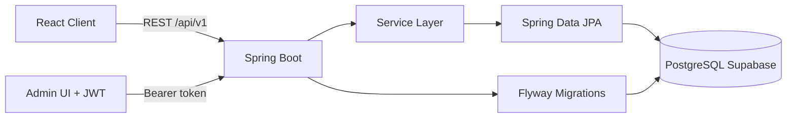
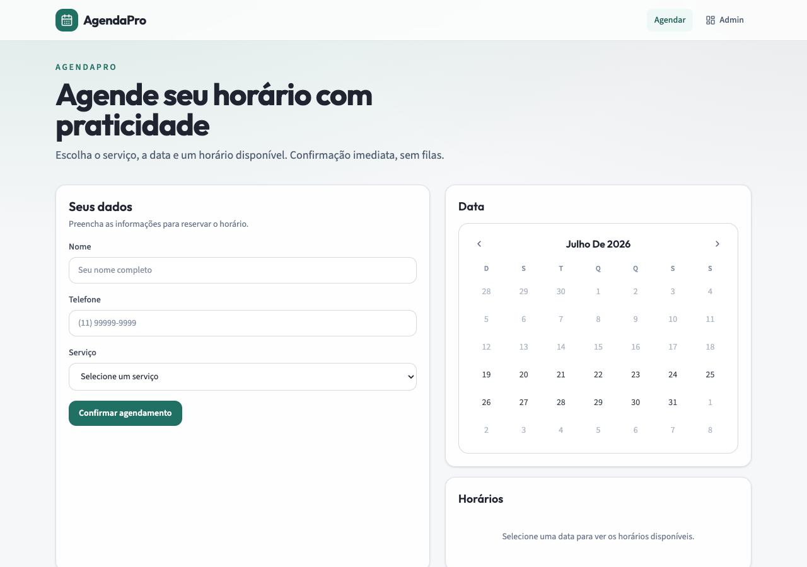

# Service Scheduler

Aplicação full stack de agendamento de serviços, desenvolvida para o desafio técnico do DevClub.

MVP funcional: clientes agendam com horários reais; administradores gerenciam a agenda com JWT; persistência em PostgreSQL (Supabase) versionada com Flyway.

[](https://openjdk.org/)
[](https://spring.io/projects/spring-boot)
[](https://react.dev/)
[](https://supabase.com/)

---

## Demo

| Link | URL |
|------|-----|
| Frontend (Vercel) | https://service-scheduler-puce.vercel.app |
| Backend (Render) | https://service-scheduler-l3g7.onrender.com |
| Health | https://service-scheduler-l3g7.onrender.com/actuator/health |
| Repositório | https://github.com/JaelsonS/service-scheduler |

API base para o frontend: `https://service-scheduler-l3g7.onrender.com/api/v1`

No Render, `CORS_ALLOWED_ORIGINS` pode listar URLs extras; o backend já libera `https://*.vercel.app` (produção e previews).

Use a URL estável da Vercel: https://service-scheduler-puce.vercel.app  
(evite abrir links de deploy temporários `*-projects.vercel.app` no dia a dia).

Credenciais da demo em produção: use as definidas em `ADMIN_EMAIL` / `ADMIN_PASSWORD` no Render (não use a senha de desenvolvimento).

Guia completo de infra: [`docs/setup-externo.md`](docs/setup-externo.md).

---

## Status do MVP

| Item | Situação |
|------|----------|
| Fluxo cliente (agendar → confirmar) | Pronto |
| Área admin (JWT, lista, status, exclusão) | Pronto |
| Testes backend (`./mvnw test`) | Pronto |
| Build frontend (`npm run build`) | Pronto |
| Documentação / ADRs | Pronto |
| Código completo no GitHub | Pronto |
| Deploy backend (Render) | Pronto |
| Deploy frontend (Vercel) | Pronto (ajustar CORS se necessário) |
| Screenshots no README | Pendente |

---

## Sumário

- [Demo](#demo)
- [Status do MVP](#status-do-mvp)
- [Descrição](#descrição)
- [Arquitetura](#arquitetura)
- [Tecnologias](#tecnologias)
- [Estrutura do repositório](#estrutura-do-repositório)
- [Como executar](#como-executar)
- [Variáveis de ambiente](#variáveis-de-ambiente)
- [API](#api)
- [Swagger](#swagger)
- [Fluxo da aplicação](#fluxo-da-aplicação)
- [Deploy](#deploy)
- [Decisões arquiteturais](#decisões-arquiteturais)
- [Trade-offs](#trade-offs)
- [Roadmap](#roadmap)
- [Screenshots](#screenshots)
- [Qualidade](#qualidade)
- [Autor](#autor)

---

## Descrição

### Área do cliente

- Selecionar serviço
- Informar nome e telefone
- Escolher data e horário disponível
- Receber confirmação do agendamento
- Horários ocupados não aparecem como disponíveis

### Área administrativa

- Login com e-mail e senha (JWT)
- Listar agendamentos com paginação
- Filtrar por data
- Alterar status (`AGENDADO` → `CONFIRMADO` → `CONCLUIDO` / `CANCELADO`)
- Visualizar dados do cliente
- Excluir agendamento
- Logout com invalidação de refresh token

---

## Arquitetura

Arquitetura em camadas no backend:

```text
Controller → Service → Repository → PostgreSQL (Supabase)
```

Organização por responsabilidade:

```text
controller | service | repository | entity | dto
exception  | validation | config | enums | utils
```

Frontend:

```text
pages → hooks → api (Axios) → backend REST
components (ui / layout / booking / auth)
```



Documentação detalhada: [`docs/architecture-decisions.md`](docs/architecture-decisions.md), [`docs/project-decisions.md`](docs/project-decisions.md) e setup externo em [`docs/setup-externo.md`](docs/setup-externo.md).

Notas de estudo para entrevista: [`docs/Estudo/README.md`](docs/Estudo/README.md).

---

## Tecnologias

| Camada | Stack |
|--------|--------|
| Backend | Java 25, Spring Boot 4.1, Spring Web, Spring Data JPA, Spring Security, Bean Validation, Flyway, springdoc OpenAPI |
| Frontend | React 19, Vite, TypeScript, Tailwind CSS 4, React Hook Form, Zod, React Router, Axios |
| Banco | PostgreSQL (Supabase) |
| Deploy | Frontend na Vercel, Backend no Render |

---

## Estrutura do repositório

```text
service-scheduler/
├── backend/                 # API Spring Boot
│   ├── src/main/java/...    # Código-fonte
│   ├── src/main/resources/  # application*.properties + Flyway
│   ├── src/test/java/...    # Testes unitários / WebMvc
│   ├── .env.example
│   └── render.yaml
├── frontend/                # SPA React
│   ├── src/
│   ├── .env.example
│   └── vercel.json
├── docs/                    # ADRs e decisões
└── README.md
```

---

## Como executar

### Pré-requisitos

- Java 25
- Maven 3.9+ (ou `./mvnw`)
- Node.js 20+
- Projeto PostgreSQL no Supabase (ou Postgres local)

### 1. Banco de dados

1. Crie um projeto no [Supabase](https://supabase.com/).
2. Em **Project Settings → Database**, copie a connection string URI.
3. Monte o JDBC:

```text
jdbc:postgresql://db.<PROJECT_REF>.supabase.co:5432/postgres
```

4. Configure `backend/.env` (nunca commitar):

```bash
cp backend/.env.example backend/.env
```

As migrations Flyway (`V1` schema, `V2` seed de serviços, `V3` admin_users) são aplicadas automaticamente na subida da API.

### 2. Backend

```bash
cd backend
export $(grep -v '^#' .env | xargs)
./mvnw spring-boot:run
```

- API: http://localhost:8080/api/v1  
- Health: http://localhost:8080/actuator/health  
- Swagger (dev): http://localhost:8080/swagger-ui.html  

Admin padrão (apenas desenvolvimento):

| Campo | Valor |
|-------|--------|
| E-mail | `admin@agendapro.local` |
| Senha | `Admin@12345` |

Altere `ADMIN_EMAIL` / `ADMIN_PASSWORD` / `JWT_SECRET` antes de qualquer deploy.

### 3. Frontend

```bash
cd frontend
cp .env.example .env
npm install
npm run dev
```

- App: http://localhost:5173  
- Login admin: http://localhost:5173/admin/login  

---

## Variáveis de ambiente

### Backend

| Variável | Descrição |
|----------|-----------|
| `DB_URL` | JDBC URL do PostgreSQL |
| `DB_USERNAME` | Usuário do banco |
| `DB_PASSWORD` | Senha do banco |
| `CORS_ALLOWED_ORIGINS` | Origens permitidas (ex.: `https://seu-app.vercel.app`) |
| `JWT_SECRET` | Segredo HMAC (≥ 32 caracteres) |
| `JWT_ACCESS_MINUTES` | Expiração do access token |
| `JWT_REFRESH_DAYS` | Expiração do refresh token |
| `ADMIN_EMAIL` | E-mail do admin inicial |
| `ADMIN_PASSWORD` | Senha do admin inicial |
| `SPRING_PROFILES_ACTIVE` | `dev` ou `prod` |
| `SPRINGDOC_ENABLED` | Habilita Swagger em produção (`false` por padrão no profile `prod`) |
| `APP_TIMEZONE` | Fuso horário da aplicação |

### Frontend

| Variável | Descrição |
|----------|-----------|
| `VITE_API_URL` | Base da API, ex.: `https://api.onrender.com/api/v1` |

---

## API

Prefixo: `/api/v1`

### Público

```text
GET    /services
POST   /appointments
GET    /appointments/{id}
GET    /appointments/availability?date=YYYY-MM-DD
POST   /auth/login
POST   /auth/refresh
POST   /auth/logout
```

### Administrativo (Bearer JWT)

```text
GET    /admin/appointments?date=&page=&size=
PATCH  /admin/appointments/{id}/status
POST   /admin/appointments/{id}/cancel
DELETE /admin/appointments/{id}
```

Erros seguem o contrato `ErrorResponseDTO` (`timestamp`, `status`, `code`, `message`, `path`, `fieldErrors`).

---

## Swagger

Em desenvolvimento, acesse:

http://localhost:8080/swagger-ui.html

No profile `prod`, a documentação fica desabilitada por padrão (`SPRINGDOC_ENABLED=false`).

---

## Fluxo da aplicação

1. Cliente abre a home, escolhe serviço, data e horário livre.
2. Backend valida regras (passado, serviço ativo, conflito) e persiste com índice único parcial.
3. Cliente vê a página de confirmação.
4. Admin autentica em `/admin/login`, recebe access + refresh JWT.
5. Admin lista, filtra, confirma, conclui, cancela ou exclui agendamentos.
6. Refresh renova a sessão; logout invalida o refresh token no servidor.

---

## Deploy

Ordem recomendada: **push no GitHub → Render (API) → Vercel (SPA) → CORS → smoke test**.

Passo a passo detalhado: [`docs/setup-externo.md`](docs/setup-externo.md).

### Frontend (Vercel)

1. Importe o repositório; **Root Directory:** `frontend`.
2. Build: `npm run build` · Output: `dist`
3. Env: `VITE_API_URL=https://<seu-backend>/api/v1`
4. `vercel.json` já configura SPA rewrite.

### Backend (Render)

1. **Language = Docker** (Render não oferece Java nativo). Use `backend/Dockerfile`.
2. Root Directory: `backend` · Dockerfile Path: `Dockerfile` (não `backend/Dockerfile` — isso duplica o path)
3. Health check: `/actuator/health`
4. Defina `DB_*`, `CORS_ALLOWED_ORIGINS`, `JWT_SECRET`, `ADMIN_*`, `SPRING_PROFILES_ACTIVE=prod`.
5. A app escuta `PORT` (Render injeta automaticamente).

### Banco (Supabase)

1. Crie o projeto PostgreSQL e use JDBC com `sslmode=require`.
2. Na primeira subida, o Flyway cria/baselina schema, seed e `admin_users`.
3. O bootstrap cria o admin se a tabela estiver vazia (em `prod`, credenciais padrão de desenvolvimento são bloqueadas).

### Antes de enviar a um recrutador

1. Push do código completo (backend + frontend + docs)
2. URLs de demo preenchidas na seção [Demo](#demo)
3. Smoke test do checklist em `docs/setup-externo.md`
4. Screenshots em `docs/screenshots/`
5. Confirmar que `.env` reais **não** estão no git

---

## Decisões arquiteturais

Resumo das decisões principais:

| Tema | Escolha |
|------|---------|
| Estilo | Camadas simples (sem Clean Architecture completa) |
| Persistência | Flyway + `ddl-auto=validate` |
| API | REST versionada `/api/v1` + DTOs |
| Concorrência | Validação na service + índice único parcial no Postgres |
| Segurança | JWT apenas para admin; booking público |
| Performance | Paginação, índices, LAZY, `open-in-view=false` |

Detalhes e trade-offs: [`docs/architecture-decisions.md`](docs/architecture-decisions.md).

---

## Trade-offs

- Autenticação de clientes ficou fora do escopo (desafio não exige).
- Duração do serviço é persistida, mas a grade de horários do MVP usa slots fixos de 30 minutos.
- Refresh tokens invalidados ficam em denylist em memória (adequado ao MVP single-instance; evoluir para persistência/Redis em escala).
- Sem Docker/CI completo nesta entrega, para priorizar qualidade do fluxo principal.

---

## Roadmap

- [ ] Reagendamento e bloqueio de feriados
- [ ] Catálogo administrativo de serviços
- [ ] Profissionais / recursos de atendimento
- [ ] Notificações (e-mail / WhatsApp)
- [ ] Testcontainers + pipeline CI
- [ ] Soft delete e auditoria
- [ ] Rate limiting e rotação de JWT com store distribuída

---

## Screenshots

Adicione imagens em `docs/screenshots/` e referencie aqui após o deploy:

1. Home de agendamento — `docs/screenshots/01-home.png`
2. Seleção de data/horários — `docs/screenshots/02-slots.png`
3. Confirmação — `docs/screenshots/03-confirmacao.png`
4. Login administrativo — `docs/screenshots/04-login.png`
5. Tabela administrativa — `docs/screenshots/05-admin.png`

```markdown

```

> Sem screenshots e sem URL ao vivo, o recrutador avalia só o código — ainda vale, mas a demo visual aumenta muito a chance de entrevista.

---

## Qualidade

```bash
# Backend
cd backend && ./mvnw test && ./mvnw verify

# Frontend
cd frontend && npm run lint && npm run type-check && npm run build
```

---

## Autor

Desenvolvido por **Jaelson Santos** para o processo seletivo DevClub.

Uso de IA como apoio à implementação e revisão, com decisões técnicas, testes e validação sob responsabilidade do autor.
